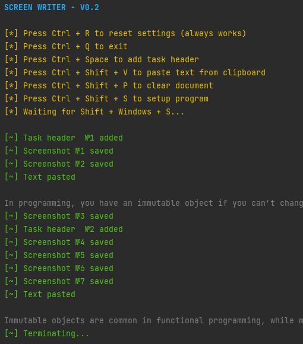

# ScreenWriter

  

ScreenWriter is a simple util that makes your daily life at university easier.

## GUI

## Installation

To install, just download ScreenWriter's
executable [file](https://github.com/CrazyProger1/ScreenWriter/releases/tag/V0.2) and place it in a convenient place.

## License

ScreenWriter is released under the MIT License. See the bundled [LICENSE](LICENSE) file for details.
